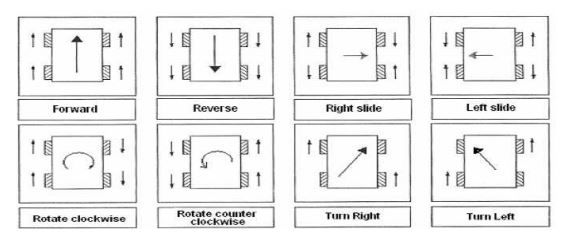

# FiveBot
Basic use for FiveBOT Mecanum 4WD Robotic Platform


|Pin|Motor 1|Motor 2|Motor 3|Motor 4|
|---|---|---|---|---|
|Speed|5|6|9|10|
|Direction|4|7|8|11|

---
###Example for running a motor
```arduino
//motor control pins
#define M1 4 
#define E1 5 

void loop() {
  analogWrite(E1, 100);		// speed (pwm)
  digitalWrite(M1, HIGH); 	// direction (LOW/HIGH)
}
```

Motor 1 and 3 is reversed relative to motor 2 and 4
so for just move on the correct command is 

||Motor 1|Motor 2|Motor 3|Motor 4|
|---|---|---|---|---|
|Direction|HIGH|LOW|HIGH|LOW|

---
###Help for move
